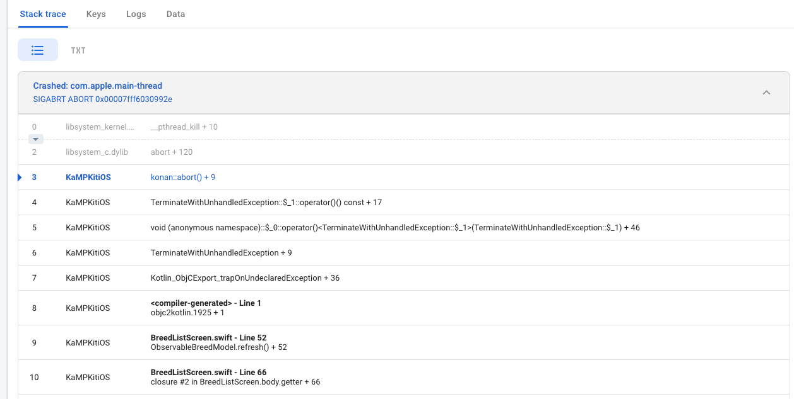
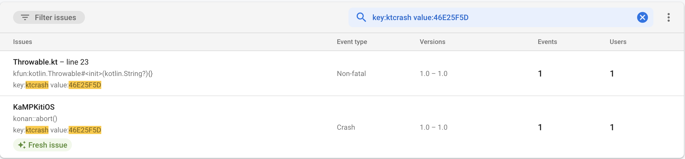
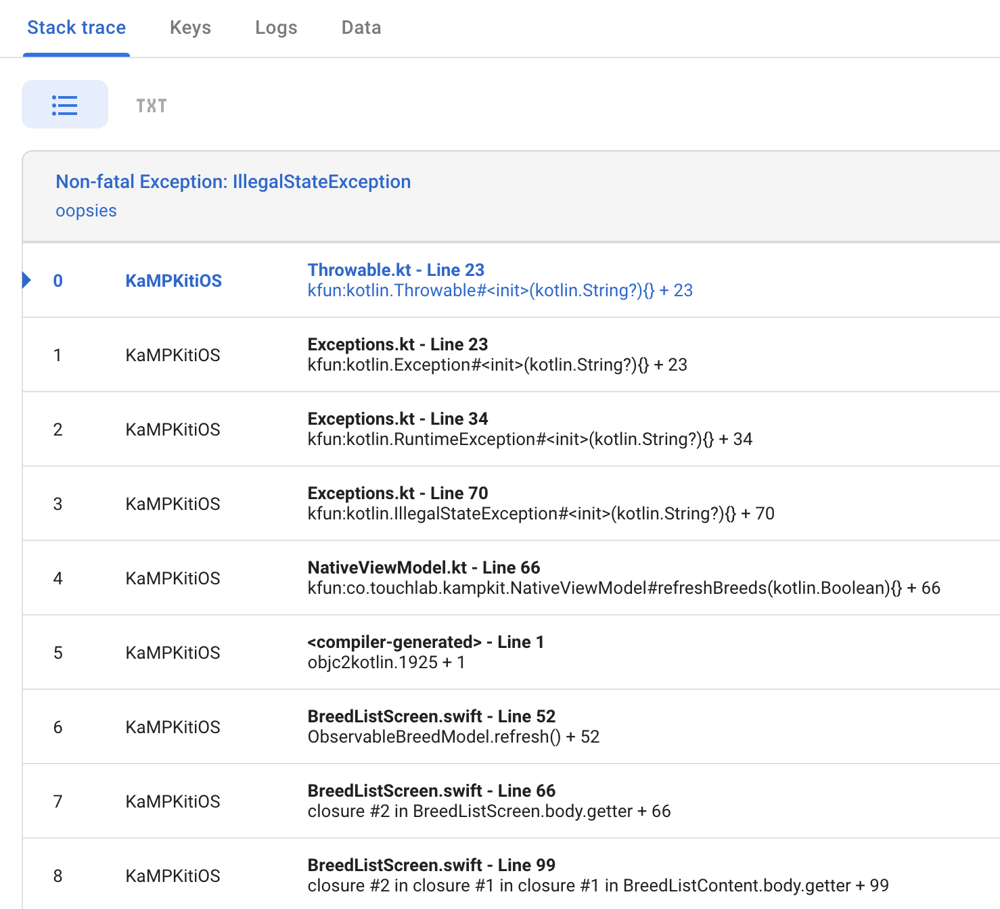

# Kermit Crash Logging - Crashlytics

With the `kermit-crashlytics` module, you can setup kermit to automatically send bread crumbs and crash reports to
Firebase Crashlytics

Note on Dynamic Frameworks: Exporting your Kotlin module as a dynamic framework creates linking issues that
prevent `kermit-crashlytics` from working, so you'll have to copy implementations into your source if a dynamic
framework is a must have. Docs coming soon to explain this process, in the mean time reach out Michael Friend or Kevin
Galligan in the kotlinlang slack with any questions.

The crash reporting APIs are not yet stable, and
require [opting into](https://kotlinlang.org/docs/opt-in-requirements.html#opt-in-to-using-api)
the `@ExperimentalKermitApi` annotation.

## Step 1: Add Crashlytics to Your Project

If you already have your app setup with Crashlytics, you can skip this step, otherwise follow the steps in the Firebase
docs to add Crashlytics crash reporting to both
your [Android](https://firebase.google.com/docs/crashlytics/get-started?authuser=0&platform=android)
and [iOS](https://firebase.google.com/docs/crashlytics/get-started?authuser=0&platform=ios)

## Step 2: Setup Kermit Crashlogging

First, make sure you have a dependency on `kermit` and `kermit-crashlytics` artifacts in your `commonMain` source set in
your shared modules `build.gradle`

```kotlin
    sourceSets {
    commonMain {
        dependencies {
                api("co.touchlab:kermit:${KERMIT_VERSION}")
                api("co.touchlab:kermit-crashlytics:${KERMIT_VERSION}")
            }
        }
...
```

Second, setup the `CrashlyticsLogWriter` with your `Logger`
### Android
If you're using Kermit's static logging, add `Logger.addLogWriter(CrashlyticsLogWriter())` at the beginning of `onCreate` in your `Application` class. Make sure to do this before anything else to ensure any log calls made doing app startup are sent to `CrashlyticsLogWriter`

If you're providing instances built from a base `Logger` instance via dependency injection, add `CrashlyticsLogger` to the base instance and ensure all other instances are built from this base. 

Example in Koin syntax
```kotlin
val baseLogger = Logger(StaticConfig(logWriterList = listOf(platformWriter(), CrashlyticsLogWriter)))
// Creates a new Logger instance using baseLogger's config with an updated tag 
factory { (tag: String?) -> if (tag!= null) baseLogger.withTag(tag) else baseKermit }
```

### iOS
Like in Android, you need to add the `CrashlyticsLogWriter` to your `Logger` instance in `application:didFinishLaunchingWithOptions:`, but for Kotlin native theres one more step that needs to happen to make sure exceptions in kotlin code are properly reported. `kermit-crashlytics` provides the `setupCrashlyticsExceptionHook` helper function to handle this for you. 

If you don't need to make kermit logging calls from Swift/Objective C code, we recommend not exporting Kermit in the framework exposed to your iOS app. To setup Kermit configuration you can make a top level helper method in the `iosMain` sourceset that you call from Swift code to avoid binary bloat. The same rule of thumb applies to `kermit-crashlytics` and since the added api is only needed for configuration, a Kotlin helper method is almost always the best option. For using static logging, this is as simple as the example below. 
```swift
// in Kermit/AppInit.kt
fun setupKermit() {
    Logger.addLogWriter(CrashlyticsLogWriter())
    setupCrashlyticsExceptionHook(Logger)
}

// in AppDelegate.swift
@UIApplicationMain
class AppDelegate: UIResponder, UIApplicationDelegate {
    ...
    func application(
        _ application: UIApplication, 
        didFinishLaunchingWithOptions launchOptions: [UIApplication.LaunchOptionsKey: Any]?
    ) -> Bool {
        // Note: This MUST be the first two statement, in this order, for Kermit and Crashlytics
        // to handle any crashes in your app launch. 
        // If the app crashes before these calls run, it will not show up properly in the dashboard
        FirebaseApp.configure()
        setupKermit()
        //...
    }
}
```

If providing instances built from a base `Logger` via DI, you need to make sure that the `setupCrashlytixsExceptionHook` call happens immediately on app launch, not lazily inside a lambda given to your DI framework. 
Example for Koin: 
```kotlin
// in iosMain
fun initKoinIos() {
    val baseLogger = Logger(StaticConfig(logWriterList = listOf(platformLogWriter(), CrashlyticsLogWriter())))
    // Note that this runs sequentially, not in the lambda pass to the module function
    setupCrashlyticsExceptionHook(log)

    return initKoin(
        module { 
            factory { (tag: String?) -> if (tag != null) baseLogger.withTag(tag) else baseLogger }
        }
    )
}
// in AppDelegate.swift
@UIApplicationMain
class AppDelegate: UIResponder, UIApplicationDelegate {
    ...
    func application(
        _ application: UIApplication, 
        didFinishLaunchingWithOptions launchOptions: [UIApplication.LaunchOptionsKey: Any]?
    ) -> Bool {
        // Note: This MUST be the first two statement, in this order, for Kermit and Crashlytics
        // to handle any crashes in your app launch. 
        // If the app crashes before these calls run, it will not show up properly in the dashboard
        FirebaseApp.configure()
        initKoinIos()
        //...
    }
}
```

# Reading iOS Crash Logs
When a crash occurs in Kotlin code, the stack trace in Crashlytics gets lost at the Swift-Kotlin barrier, which can make it difficult to determine the root cause of a crash that happens in Kotlin. 



To remedy this, `kermit-crashlytics` reports unhandled Kotlin exceptions as separate, non-fatal exceptions, which will show up in Crashlytics with a readable stack trace. Each Kotlin crash event will have a non-fatal even with a matching unique value for the `ktcrash` key that will allow you to see the stacktrace of the exception. 


Once you find the associated non fatal crash, you'll be able to see the full stack trace of the kotlin exception

